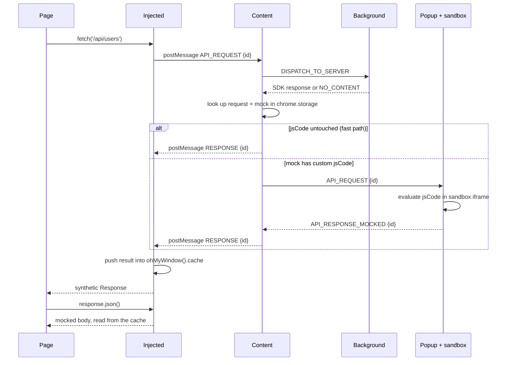

# How a request becomes a mocked response

The journey of one `fetch()` call, from the moment the page makes it to the
moment it gets an answer back. It crosses **five execution contexts**, and each
boundary changes what the data is allowed to be — which is most of why this part
of the codebase is hard to follow.

Read [messaging.md](./messaging.md) first if the message bus is new to you.

## The five contexts

| Context | Runs in | Can reach |
|---|---|---|
| **Page** | the website's own JS world | the real `fetch`/`XHR`, nothing of the extension |
| **Injected** (`src/injected`) | same JS world as the page | `window`, `postMessage` — **no `chrome.*` at all** |
| **Content** (`src/content`) | isolated world, same tab | `chrome.storage`, `chrome.runtime`, and `window.postMessage` |
| **Background** (`src/background`) | MV3 service worker, one per browser | all `chrome.*`, the SDK websocket |
| **Popup** (`src/app`) | its own extension window | `chrome.*`, and the sandboxed iframe that evaluates mock code |

The injected script is the only one that can patch `fetch`, because patching has
to happen in the page's own world. It is also the only one with no extension
APIs — which is why every piece of state has to be shipped to it by message.

## The happy path, end to end



## Step by step, with the types

### 1. The patch — page → injected

`src/injected/mock-oh-fetch.ts` replaces `window.fetch`; `src/injected/mock-oh-xhr.ts`
does the same for `XMLHttpRequest.prototype.send`.

There is a race here: the page can call `fetch` before the injected bundle has
loaded. `src/early-inject/index.ts` is a tiny shim injected **synchronously**
that installs a placeholder which polls until the real patch arrives. It is
inlined into `content.js` as a string — see the warning at the top of that file
about template literals.

If mocking is switched off, the patch forwards to the original straight away:

```ts
if (!ohMyWindow().state?.active) {
  return originalFetch()(request, config);
}
```

### 2. Injected → content

`src/injected/message/dispatch-api-request.ts` mints a correlation id, subscribes
to the answer, and posts:

```ts
const payload: IPacketPayload<IOhMyAPIRequest, IOhMyPacketContext> = {
  context: { id, requestType },   // note: no domain — the page world has no idea
  type: payloadType.API_REQUEST,
  data: request                   // IOhMyAPIRequest: { url, method, body?, headers? }
};
```

The transport is `window.postMessage`, addressed to this document's own origin.
The receiver checks `event.source === window`, so a script in an iframe cannot
impersonate the injected script — see `src/shared/utils/trigger-msg-window.ts`.

### 3. Content: ask the SDK server first

`src/content/handle-api-request.ts` is the hub. It first asks the background
whether the optional NodeJS SDK has an answer:

```ts
const response = await OhMySendToBg.full<IOhMyAPIRequest, IOhMyMockResponse>(
  inputRequest, payloadType.DISPATCH_TO_SERVER, context);
```

The background (`src/background/server-dispatcher.ts`) forwards over the
websocket if one is connected, and otherwise replies `NO_CONTENT`. The SDK wins
when it answers; the stored mocks are the fallback.

This is also where the packet context becomes a **state** context. A message
from the page carries only `{ id, requestType }`; `OhMySendToBg` adds the domain,
and the content script merges in the state's `preset`. `IOhMyPacketContext` and
`IOhMyContext` are deliberately separate types for this reason.

### 4. Content: find the mock

```ts
const data = StateUtils.findRequest(contentState.state, contentState.requests, inputRequest);
const mockId = DataUtils.activeMock(data, context);   // undefined if the preset is disabled
const mock = await contentState.get<IMock>(mockId);  // IMock | undefined
```

`findRequest` takes the requests as an argument because they are no longer part
of the state: each is its own `chrome.storage` record, and `OhMyContentState`
keeps a map of them fresh from `chrome.storage.onChanged`. That keeps the
lookup synchronous — it runs for every intercepted request — while the write
that follows it (`lastHit`) touches one small record instead of the whole
domain.

### 5. The fork: fast path or sandbox

```ts
if (!data || mock?.jsCode === MOCK_JS_CODE || !mockId) {
  // serve directly
} else {
  // send to the popup for evaluation
}
```

**This single condition explains the extension's most confusing behaviour.**
While a mock's code is the untouched default, the content script answers by
itself and the popup does not need to be open. Edit that code and the mock can
only be served while the popup *is* open, because the sandbox lives there.

`MockUtils.mockToResponse` builds the answer — and note it reads `responseMock`
and `headersMock`, not `response`/`headers`:

```ts
{ status: OK, response: mock.responseMock, headers: mock.headersMock,
  delay: mock.delay, statusCode: mock.statusCode }
```

### 6. The sandbox leg (custom code only)

The popup receives `API_REQUEST` in `src/app/services/content.service.ts` and
hands it to `SandboxService.dispatch`, which posts into a **sandboxed iframe**
(`sandbox.html`, declared under `"sandbox"` in the manifest). That frame runs
`eval()` on the user's mock code — see `src/shared/utils/eval-jscode.ts`.

The sandbox exists because extension pages have a CSP that forbids `eval`. A
sandboxed frame has no extension privileges and its own origin, so user code
cannot reach `chrome.*` or the user's data. The code receives:

```ts
(mock: Partial<IOhMyMockResponse>, request: IOhMyAPIRequest, response?: IOhMyMockResponse)
  => Partial<IOhMyMockResponse>
```

`Partial`, because user code returns whatever it likes; `evalCode` fills in the
`status` afterwards.

The result travels back as `API_RESPONSE_MOCKED`, straight to the content script
via `chrome.tabs.sendMessage` — the popup does not route through the background.

### 7. Content → injected

Either way, `handleResponse` posts the answer back with the same correlation id:

```ts
sendMessageToInjected({
  type: payloadType.RESPONSE,
  data: { request, response } as IOhMyReadyResponse,
  context
});
```

If nothing produced a response, it falls back to `{ status: NO_CONTENT }`, which
the injected side reads as "let the request through".

### 8. Injected: the cache, and why it exists

This is the part that surprises people. `ohMyFetch` cannot return the body
directly, because `fetch` must resolve with a real `Response` object. So it
resolves with an **empty** `Response` constructed with the mocked status:

```ts
const resp = new Response(null, { status: toValidResponseStatus(statusCode) });
resp.ohUrl = url;
resp.ohMethod = config.method;
```

The body arrives later, when the page calls `.json()` / `.text()` / `.blob()`.
Those readers are patched on `Response.prototype` (`src/injected/fetch/*.ts`) and
each one looks the answer up in `ohMyWindow().cache` by url + method:

```ts
this.ohResult = findCachedResponse({ url: this.ohUrl, method: this.ohMethod });
```

`findCachedResponse` **removes** the entry it returns, so one queued response
serves one read. XHR works the same way, through patched `status`,
`responseText` and `response` getters.

That indirection — an empty Response now, the body on first read — is the price
of pretending to be `fetch`.

## What this design cannot see

Everything here hangs off patched `fetch`/`XHR` in the page's main world, so
these are invisible by construction:

- requests from **web workers** and **service workers** (separate JS worlds)
- requests from **iframes** — the manifest does not set `all_frames`
- ``, `<script>`, `<link>` loads, navigations, `EventSource`, `WebSocket`
- anything issued before the early-inject shim lands

See [interception.md](./interception.md) for why this approach was chosen anyway
and what the alternatives would cost.

## Where the types live

| Type | File | What it is |
|---|---|---|
| `IOhMyAPIRequest` | `shared/type.ts` | the intercepted request |
| `IOhMyMockResponse` | `shared/type.ts` | an answer: status + optional body/headers/delay |
| `IOhMyReadyResponse` | `shared/packet-type.ts` | `{ request, response }` — what travels back |
| `IPacket` / `IPacketPayload` | `shared/packet-type.ts` | the message envelope |
| `IOhMyContext` | `shared/type.ts` | **state** context — has a `preset` |
| `IOhMyPacketContext` | `shared/packet-type.ts` | **message** context — only the domain, and only after the content hop |
| `IData` | `shared/type.ts` | a stored request, with its mocks per preset — its own storage record, listed by id in `IState.requests` |
| `IMock` | `shared/type.ts` | one stored response |
| `IOhMyWindow` | `shared/oh-my-window.ts` | the namespace on `window`, shared by injected and content |
