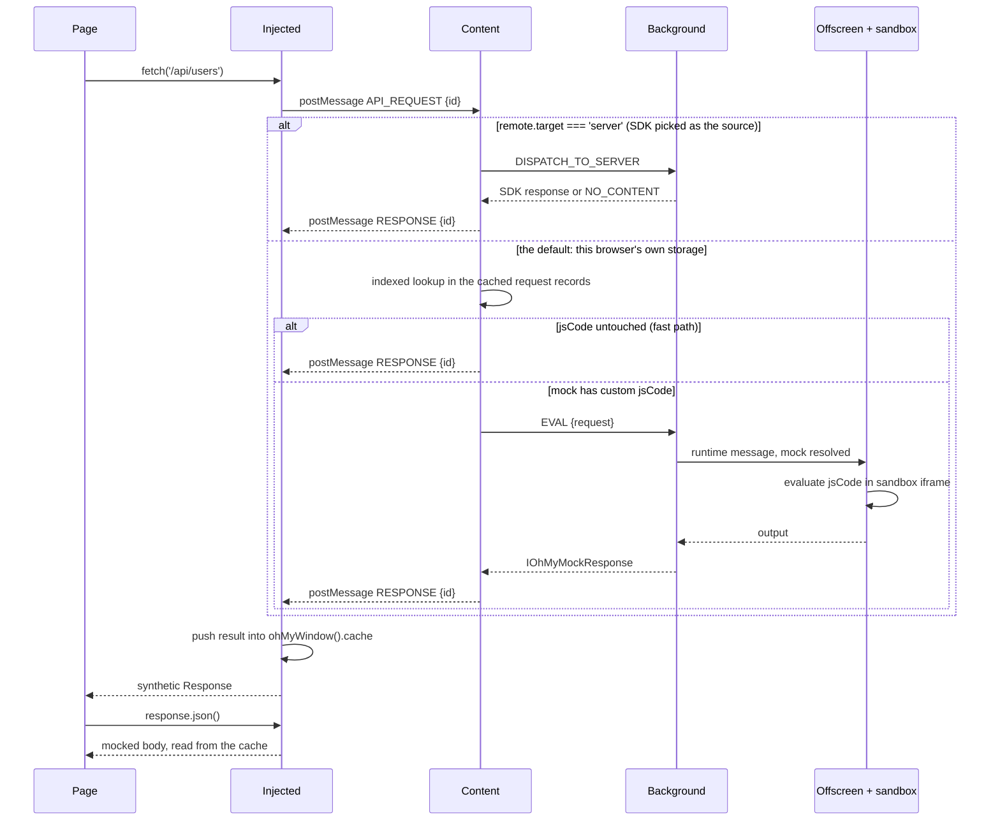

# How a request becomes a mocked response

The journey of one `fetch()` call, from the moment the page makes it to the
moment it gets an answer back. A plain mock crosses **three execution
contexts**; one with custom code crosses **six** — and each boundary changes
what the data is allowed to be, which is most of why this part of the codebase
is hard to follow.

Read [messaging.md](./messaging.md) first if the message bus is new to you.

## The contexts

| Context | Runs in | Can reach |
|---|---|---|
| **Page** | the website's own JS world | the real `fetch`/`XHR`, nothing of the extension |
| **Injected** (`src/injected`) | same JS world as the page | `window`, `postMessage` — **no `chrome.*` at all** |
| **Content** (`src/content`) | isolated world, same tab | `chrome.storage`, `chrome.runtime`, and `window.postMessage` |
| **Background** (`src/background`) | MV3 service worker, one per browser | all `chrome.*`, the SDK websocket |
| **Popup** (`src/app`) | its own extension window | `chrome.*` — and nothing the mocking path depends on |
| **Offscreen** (`src/offscreen`) | a hidden page owned by the background | `chrome.runtime`, and it holds the sandboxed iframe |
| **Sandbox** (`src/sandbox`) | iframe with an opaque origin | may `eval`; reaches **no** `chrome.*` |

The injected script is the only one that can patch `fetch`, because patching has
to happen in the page's own world. It is also the only one with no extension
APIs — which is why every piece of state has to be shipped to it by message.

## The happy path, end to end



## Step by step, with the types

### 1. The patch — page → injected

`src/injected/mock-oh-fetch.ts` publishes the mocking `fetch`;
`src/injected/mock-oh-xhr.ts` does the same for `send`. Both hang off the
OhMyMock namespace, and it is the *entry points* that forward to them — so an
inactive domain can take them away again without the page's `window.fetch`
changing identity twice.

`window.fetch` and `XMLHttpRequest.prototype` are taken over by
`src/injected/entry-points.ts`, the first statement the bundle runs. There is no
race to lose: the bundle is a `world: 'MAIN'` content script registered per
active domain, so it is evaluated at `document_start`, before any script the
page has of its own. See
[interception.md](./interception.md#how-the-bundle-gets-onto-the-page) — and the
shim, the hold and the 50ms poll that used to bridge the gap between two
scripts are gone with it.

If mocking is switched off the patch forwards to the original, read
synchronously:

```ts
if (!ohMyWindow().state?.active) {
  return originalFetch().call(window, request, config);
}
```

`state` starts out `{ active: true }`, because the bundle being on the page is
what says the host is mocked. The content script only ever corrects that
downwards — for another port of the same host, or a domain switched off while
the page is open. It used to be `await isMockingActive()`, a three-state wait
that existed because the bundle went onto every page in the browser and could
not know.

The wait did not vanish, it moved: `handle-api-request.ts` awaits
`contentState.init()` before looking anything up, so a request that arrives
while `chrome.storage` is still being read has its *answer* held rather than
being told "no mock". That is the same guarantee without a patched `fetch` that
blocks.

### 2. Injected → content

`src/injected/message/dispatch-api-request.ts` mints a correlation id, subscribes
to the answer, and posts:

```ts
const payload: IPacketPayload<IOhMyAPIRequest, IOhMyPacketContext> = {
  context: { id, requestType },   // note: no domain — the page world has no idea
  type: payloadType.API_REQUEST,
  data: request                   // IOhMyAPIRequest: { url, method, body?, headers? }
};
```

The transport is `window.postMessage`, addressed to this document's own origin.
The receiver checks `event.source === window`, so a script in an iframe cannot
impersonate the injected script — see `src/shared/utils/trigger-msg-window.ts`.

### 3. Content: which source answers

`src/content/handle-api-request.ts` is the hub. The first fork is *whose
storage the mocks come from* — one source, not one layered on another:

```ts
const servedElsewhere = contentState.store?.remote?.target === 'server';

const response = servedElsewhere
  ? await OhMySendToBg.full<IOhMyAPIRequest, IOhMyMockResponse>(
      inputRequest, payloadType.DISPATCH_TO_SERVER, context)
  : { status: ohMyMockStatus.NO_CONTENT };
```

With the SDK picked (`remote.target === 'server'`), the background
(`src/background/server-dispatcher.ts`) forwards over the websocket and
whatever comes back is the answer — including "nothing", which the injected
script reads as "not mocked" and lets through to the real server. This
browser's own mocks are **not** consulted; a source is a source, not a
fallback. That replaced the old always-ask-the-SDK-first behaviour, which cost
every request a background round trip whether or not anything was listening.

With the default target, nothing is sent to the background at all and the
lookup below decides.

This is also where the packet context becomes a **state** context. A message
from the page carries only `{ id, requestType }`; the content script pins the
domain — a fact only it has, see the comment in `handle-api-request.ts` on why
the message may not bring its own — and merges in the state's `preset`.
`IOhMyPacketContext` and `IOhMyContext` are deliberately separate types for
this reason.

### 4. Content: find the mock

```ts
const data = contentState.requestIndex().find(inputRequest, contentState.activeGroups());
const mockId = DataUtils.activeMock(data, state.context); // undefined if the preset is disabled
const mock = await contentState.get<IMock>(mockId);       // IMock | undefined
```

The lookup is indexed and group-aware. `OhMyContentState` keeps the request
and group records fresh from `chrome.storage.onChanged` — each is its own
`chrome.storage` record, not part of the domain state — and
`OhMyRequestIndex` (`src/shared/utils/request-index.ts`) is rebuilt lazily on
the first lookup after anything changed. Passing `activeGroups()` is what makes
a switched-off mock group stop answering; the plain `StateUtils.findRequest`
scan still exists for the popup and the background, which ask occasional
questions rather than one per intercepted call.

A hit no longer writes storage on the spot either. `data.lastHit` /
`data.calledAt` are updated in the local copy and handed to `recordHit`
(`src/content/hit-batch.ts`), which tells the popup immediately but batches the
storage write on a 250ms timer — one small record per interval instead of a
service-worker wake, a disk write and a browser-wide `onChanged` fan-out per
intercepted request.

### 5. The fork: fast path or sandbox

```ts
if (!data || !mock || mock.jsCode === MOCK_JS_CODE || !mockId) {
  // serve directly (or let through, when there is nothing to serve)
} else {
  // ask the background to run it
}
```

While a mock's code is the untouched default, the content script answers by
itself. Edit that code and it has to be *run*, which only a sandboxed page may
do — so the request takes the longer leg below.

**This used to be the extension's most confusing behaviour.** The sandbox was an
iframe on the popup page, so editing one character of a mock's code made it work
only while the popup happened to be open; with it closed the request paid the
full 5s `sendMsg2Popup` timeout, went through unmocked, and the content script
switched the domain off on its way out. The background owns the sandbox now and
is always there, so the fork is a detour rather than a trap.

`MockUtils.mockToResponse` builds the answer — and note it reads `responseMock`
and `headersMock`, not `response`/`headers`:

```ts
{ status: OK, response: mock.responseMock, headers: mock.headersMock,
  delay: mock.delay, statusCode: mock.statusCode }
```

### 6. The sandbox leg (custom code only)

Three hops, because each end can do exactly one thing the others cannot:

| | can it hold a DOM? | can it `eval`? | can it reach `chrome.*`? |
| --- | --- | --- | --- |
| Background (service worker) | no | no | yes |
| Offscreen document | yes | no | yes |
| Sandboxed iframe | yes | **yes** | no |

`src/background/eval-dispatcher.ts` answers `payloadType.EVAL`: it resolves the
request to a mock — the lookup lives here, so the page holding the frame needs no
state of its own — and calls `evalInSandbox` in `src/background/sandbox-host.ts`.
That ensures the offscreen document exists (`chrome.offscreen.hasDocument`,
created with reason `IFRAME_SCRIPTING`) and sends the mock to it.
`src/offscreen/index.ts` is a pure relay: it posts into the **sandboxed iframe**
(`sandbox.html`, declared under `"sandbox"` in the manifest), which runs `eval()`
on the user's code — see `src/shared/utils/eval-jscode.ts`.

The sandbox exists because extension pages have a CSP that forbids `eval`. A
sandboxed frame has no extension privileges and its own origin, so user code
cannot reach `chrome.*` or the user's data. The code receives:

```ts
(mock: Partial<IOhMyMockResponse>, request: IOhMyAPIRequest, response?: IOhMyMockResponse)
  => Partial<IOhMyMockResponse>
```

`Partial`, because user code returns whatever it likes; `evalCode` fills in the
`status` afterwards.

The result travels back the way it came: sandbox → offscreen → background →
content script, as the resolved value of the content script's own `EVAL` call.

Replies are correlated by an id the background generates, **not** by the mock's
id. Two calls to one endpoint are in flight at once often enough, and keyed by
mock id the second would have been handed the first's answer.

The offscreen API is why `minimum_chrome_version` is 109, and why the manifest
asks for the `"offscreen"` permission — it is the latest-arriving API the
extension uses, later than everything MV3 and `chrome.scripting` need. Every
floor is tabulated with its source in
[`interception.md`](./interception.md#what-chrome-version-this-actually-needs).
Only one offscreen document may exist per
profile, so `ensureDocument` funnels concurrent callers through a single
in-flight creation promise.

### 7. Content → injected

Either way, `handleResponse` posts the answer back with the same correlation id:

```ts
sendMessageToInjected({
  type: payloadType.RESPONSE,
  data: { request, response } as IOhMyReadyResponse,
  context
});
```

If nothing produced a response, it falls back to `{ status: NO_CONTENT }`, which
the injected side reads as "let the request through".

### 8. Injected: the cache, and why it exists

This is the part that surprises people. `ohMyFetch` cannot return the body
directly, because `fetch` must resolve with a real `Response` object. So it
resolves with an **empty** `Response` constructed with the mocked status:

```ts
const resp = new Response(null, { status: toValidResponseStatus(statusCode) });
resp.ohUrl = url;
resp.ohMethod = config.method;
```

The body arrives later, when the page calls `.json()` / `.text()` / `.blob()`.
Those readers are patched on `Response.prototype` (`src/injected/fetch/*.ts`) and
each one looks the answer up in `ohMyWindow().cache` by url + method:

```ts
this.ohResult = findCachedResponse({ url: this.ohUrl, method: this.ohMethod });
```

`findCachedResponse` **removes** the entry it returns, so one queued response
serves one read. XHR works the same way, through patched `status`,
`responseText` and `response` getters.

That indirection — an empty Response now, the body on first read — is the price
of pretending to be `fetch`.

## What this design cannot see

Everything here hangs off patched `fetch`/`XHR` in the page's main world, so
these are invisible by construction:

- requests from **web workers** and **service workers** (separate JS worlds)
- requests from **iframes** — the manifest does not set `all_frames`
- ``, `<script>`, `<link>` loads, navigations, `EventSource`, `WebSocket`
- anything on a page the bundle was not registered for — see
  [interception.md](./interception.md#how-the-bundle-gets-onto-the-page)

See [interception.md](./interception.md) for why this approach was chosen anyway
and what the alternatives would cost.

## Where the types live

| Type | File | What it is |
|---|---|---|
| `IOhMyAPIRequest` | `shared/types/api-request.ts` | the intercepted request |
| `IOhMyMockResponse` | `shared/types/api-response.ts` | an answer: status + optional body/headers/delay |
| `IOhMyReadyResponse` | `shared/packet-type.ts` | `{ request, response }` — what travels back |
| `IPacket` / `IPacketPayload` | `shared/packet-type.ts` | the message envelope |
| `IOhMyContext` | `shared/types/context.ts` | **state** context — has a `preset` |
| `IOhMyPacketContext` | `shared/packet-type.ts` | **message** context — only the domain, and only after the content hop |
| `IData` | `shared/types/request.ts` | a stored request, with its mocks per preset — its own storage record, listed by id in `IState.requests` |
| `IMock` | `shared/types/mock.ts` | one stored response |
| `IOhMyWindow` | `shared/oh-my-window.ts` | the namespace on `window`, shared by injected and content |

`shared/type.ts` is now a barrel over `shared/types/*` — importing from it still
works everywhere, but the concept file is the clearer import.
